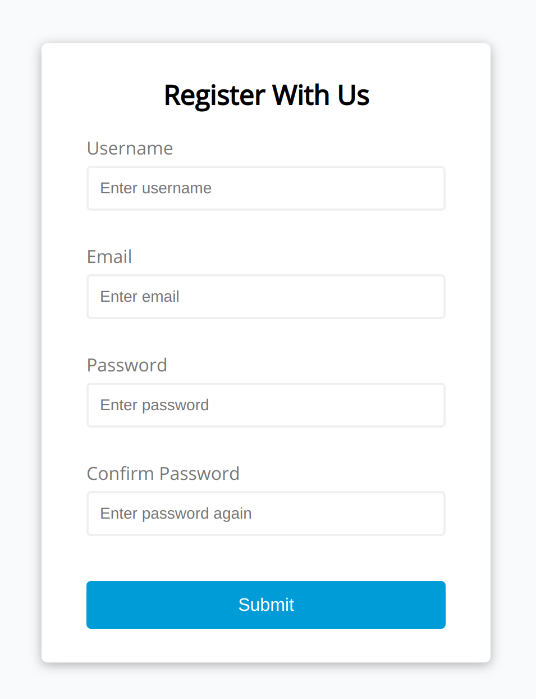

# Form-validator

simple form validator using vanilla JavaScript

### Functions

[The app](https://tn-space.github.io/Form-validator/)

Each field is quired. \
Email check. \
Password and Confirm Password have to match.

### Images

